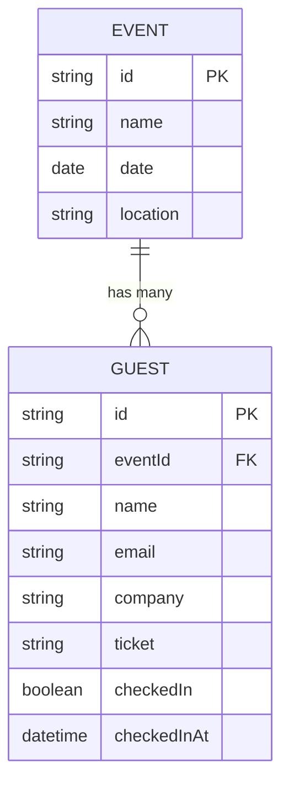
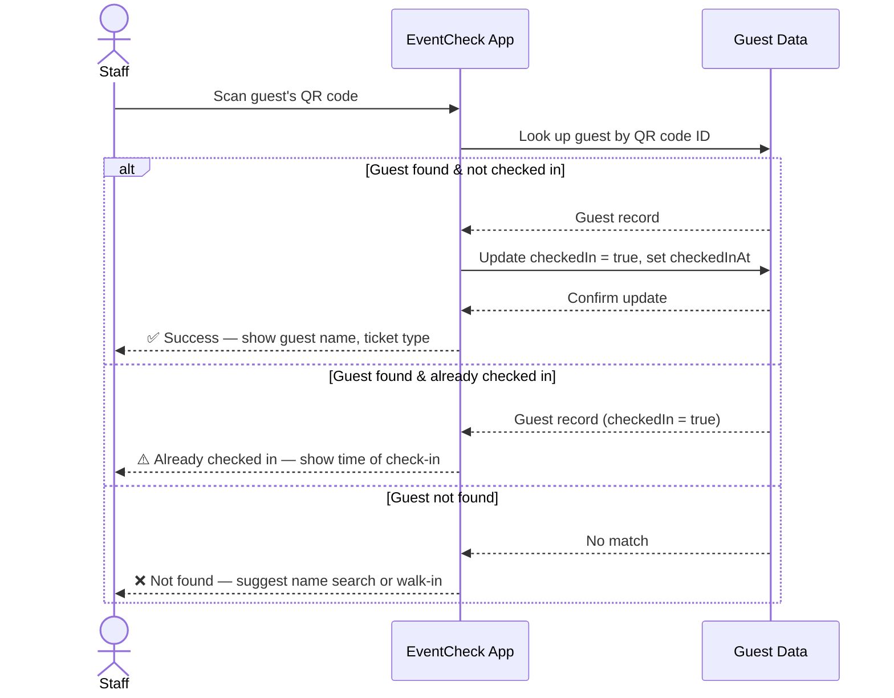
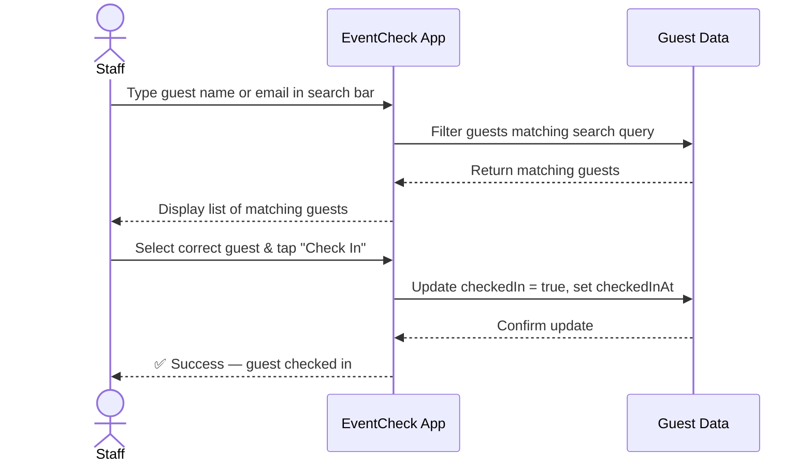
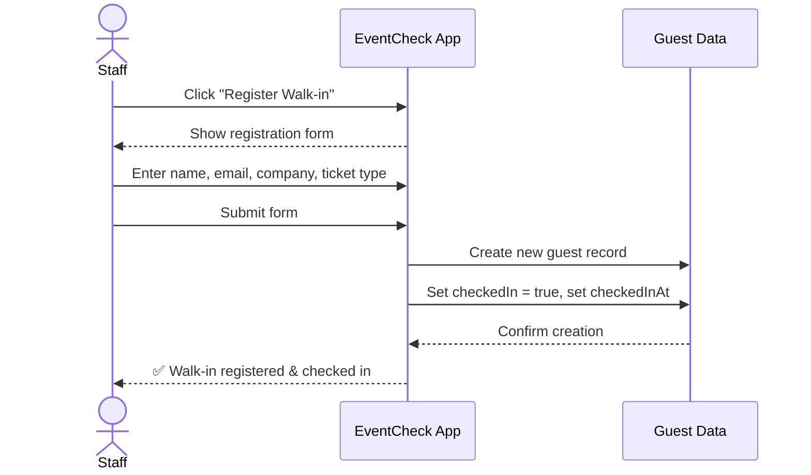
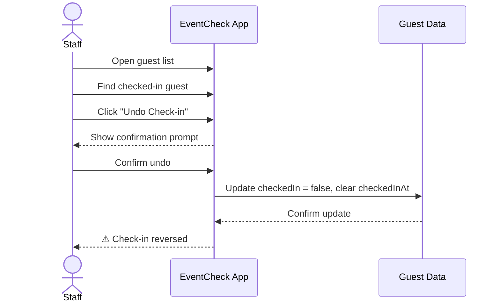

# EventCheck — Guest Registration App

## Overview

**EventCheck** is a guest registration and check-in app built for **DevConnect 2026**, a one-day regional tech conference with 200–400 attendees. The app is designed to be used by event staff at the registration desk on the day of the event.

---

## Assumptions

### About the Event
- **Event type:** A one-day tech conference (talks, panels, networking).
- **Scale:** 200–400 pre-registered attendees, plus an estimated 10–20 walk-ins on the day.
- **Attendee types:** General admission, VIP (premium ticket holders), and Speakers/Panelists.
- **Registration flow:** Guests register online before the event and receive a confirmation email containing a unique QR code. On event day, they present the QR code at the registration desk to check in.

### About How the App Would Be Used
- Operated by 1–2 event staff members at a physical registration desk, likely on a laptop or tablet.
- The primary goal is **speed** — minimising queue time during the morning check-in rush.
- Internet connectivity at the venue may be unreliable, so the app should function with minimal server dependency during check-in.
- Staff are not technical users; the interface must be intuitive with no training required.

---

## Check-in Approach: QR Code + Name Search Fallback (Hybrid)

### Why I Kept QR Codes as the Primary Method
The client's requirement for QR code check-in is well-suited to a tech conference:
- Attendees pre-register online, so QR codes can be generated and sent in advance.
- Scanning is fast (under 3 seconds per guest), which is critical during peak check-in times.
- It reduces human error compared to manually searching for names (no misspellings, no duplicate name confusion).
- It's contactless and feels modern — appropriate for a tech audience.

### Why I Added a Name/Email Search Fallback
In practice, QR-only check-in creates a bottleneck when things go wrong. Common real-world scenarios:
- A guest's phone is dead or out of battery.
- The guest can't find the confirmation email.
- The QR code won't scan due to screen glare or a cracked screen.
- A guest registered under a different email and doesn't have the code.

Rather than making these guests wait or sending them away, staff can search by name or email and check them in manually. This keeps the line moving.

**This is not a replacement for QR codes — it's a safety net.** The QR code remains the primary and recommended check-in method.

---

## Features I Prioritised

### 1. QR Code Scanning (Core)
- Scan a guest's QR code to instantly retrieve their registration and mark them as checked in.
- Clear visual feedback: success (green), already checked in (amber), or not found (red).
- Duplicate scan protection to prevent confusion.

### 2. Name/Email Search Fallback (Core)
- A search bar that lets staff quickly find a guest by name or email.
- Results appear as the staff types (no need to press "search").
- One-tap check-in from the search results.

### 3. Walk-in Registration (Extra)
- A simple form to register a guest who wasn't pre-registered.
- Captures name, email, company, and ticket type.
- Immediately checks the guest in after registration.

### 4. Guest List View
- A searchable, filterable list of all registered guests.
- Shows check-in status at a glance.
- Allows manual check-in and undo (in case of mistakes).

---

## What I Consciously Left Out

| Feature | Why I Left It Out |
|---|---|
| **Live analytics dashboard** | Nice to have, but not essential for the registration desk on event day. Staff need to check people in, not analyse data. Analytics can be generated after the event from the check-in data. |
| **Badge/label printing** | Would require hardware integration (printer setup, label templates) that adds complexity without being part of the core check-in flow. |
| **Dietary/accessibility tracking** | Useful for catering, but this data is better collected during online registration — not at the check-in desk where speed is the priority. |
| **Multi-device sync** | Would require a backend with real-time database (e.g., Firebase). For a prototype, a single-device app is sufficient and avoids over-engineering. |
| **User authentication / admin roles** | Adds complexity. For a prototype used at a single registration desk, it's unnecessary. |
| **Email/SMS notifications** | Out of scope for a check-in app. This belongs in the registration platform. |

**Guiding principle:** "A simple app that works end-to-end is more valuable than an ambitious one that is half-finished."

---

## What I Would Build Next (Given More Time)

**Week 2–3: Operational improvements**
- Real-time sync across multiple devices using Firebase or Supabase, so two registration desks can operate simultaneously without conflicts.
- Offline mode with local storage that syncs when connectivity is restored.
- Undo/edit history with timestamps for accountability.

**Week 3–4: Event organiser features**
- Post-event analytics dashboard (check-in rate over time, peak hours, no-shows).
- CSV/Excel export of attendance data.
- Pre-event guest list import (CSV upload).

**Future considerations**
- Badge printing integration.
- Self-service kiosk mode where guests scan their own QR code without needing staff.
- SMS/email confirmation sent automatically after check-in.
- Support for multi-day events with per-session check-in.

---

## Tech Stack

| Layer | Technology |
|---|---|
| **UI Framework** | React |
| **Build Tool** | Vite |
| **QR Scanning** | html5-qrcode |
| **Styling** | Tailwind CSS / CSS Modules |
| **State Management** | React useState / useContext |
| **Data Storage** | In-memory (React state) |
| **Linting** | ESLint |

---

## Technology Choices

| Decision | Choice | Reasoning |
|---|---|---|
| **Framework** | React with Vite | Vite gives a fast setup with no unnecessary server-side complexity. This is a client-side app used at a registration desk — there's no SEO or SSR requirement. Next.js would be over-engineering for a prototype. |
| **QR scanning** | `html5-qrcode` library | Well-maintained, works with device cameras, and has a simple API. No native app required. |
| **Styling** | Tailwind CSS (or CSS modules) | Rapid prototyping without writing custom CSS from scratch. Keeps the codebase clean. |
| **State management** | React useState/useContext | The app's state is simple (a list of guests and their check-in status). No need for Redux or Zustand at this scale. |
| **Data storage** | In-memory (prototype) | For the prototype, guest data is stored in React state. In production, this would be replaced with a database. |

---
## Database Schema


---

## Sequence Diagrams

### Use Case 1: QR Code Check-in



### Use Case 2: Name/Email Search Fallback



### Use Case 3: Walk-in Guest Registration



### Use Case 4: Undo Check-in



---

## AI Tool Documentation

### AI Coding Harness
- **Tool used:** Claude Code (Anthropic) — CLI-based AI coding assistant running directly in the terminal inside the project directory.
- **Setup:** Installed via `npm install -g @anthropic-ai/claude-code`, then launched with `claude` in the project root. No additional configuration was needed — Claude Code automatically read the project structure and existing files at the start of each session.

### How I Used AI During the Build

My workflow was plan-first, then execute. I wrote a detailed implementation plan (component by component, with exact state shape, props, and behaviour) and handed it to Claude Code to implement. This meant I was making the architectural decisions — Claude Code was responsible for translating them into working code.

The process looked like this:
1. Wrote the full plan (data model, state design, component breakdown, implementation order)
2. Asked Claude Code to implement the plan in order
3. Ran `npm run dev` to test in the browser after each major step
4. Caught issues through testing (blank screen, persistent undo toast) and asked Claude Code to fix specific bugs with clear descriptions of what was wrong

Claude Code ran `npm install`, created all source files, edited `vite.config.js` and `index.css` for Tailwind v4, and fixed bugs when I reported them — all through natural language instructions in the terminal.

### Example: Where I Changed or Rejected an AI Suggestion

- **What the AI suggested:** Claude Code initially set the default active tab to `'scan'` (the QR scanner), which caused the app to show a blank white screen on first load because `html5-qrcode` was crashing during camera initialisation before the user had granted permission.
- **What I did instead:** I asked Claude Code to change the default tab to `'list'` (the Guest List), so the app always renders useful content on load. I also asked it to refactor `QRScanner` to load `html5-qrcode` via a dynamic `import()` inside the `useEffect`, so any import-time errors are isolated and don't crash the whole app.
- **Why:** The QR scanner should be opt-in — a staff member opening the app for the first time should see the guest list, not a broken camera view. Defensive loading also makes the app more resilient on devices where camera access is unavailable.

### Example: Where AI Helped Me Learn Something New

- **The problem:** The app worked fine in the browser on my Mac but the QR scanner wouldn't activate when I opened it on my iPhone via the local network IP (`http://192.168.1.7:5173`). I assumed it was a permissions issue and kept checking iOS camera settings.
- **How AI helped:** Claude Code explained that browsers enforce a "secure context" requirement for camera access via `getUserMedia()`. `localhost` gets a special exception, but any other origin — including a local IP address — must be served over HTTPS before the browser will allow camera access. It then walked me through three options to add HTTPS: ngrok, a Cloudflare tunnel, or Vite's `@vitejs/plugin-basic-ssl` for a self-signed certificate.
- **What I learned:** HTTPS is not just a production concern — it's required for any browser API that accesses sensitive hardware (camera, microphone, geolocation) even on a local network. This is a browser security standard enforced across Chrome, Safari, and Firefox, not an iOS-specific restriction.

---

## How to Run the Prototype

```bash
# Clone the repository
git clone [your-repo-url]
cd eventcheck

# Install dependencies
npm install

# Start the development server
npm run dev
```

Open `http://localhost:5173` in your browser.

---

## Project Structure

```
eventcheck/
├── public/
├── src/
│   ├── components/
│   │   ├── QRScanner.jsx        # Camera-based QR code check-in
│   │   ├── GuestSearch.jsx      # Real-time name/email search fallback
│   │   ├── GuestList.jsx        # Full guest list with filters and undo
│   │   ├── WalkInForm.jsx       # Walk-in guest registration form
│   │   ├── GuestCard.jsx        # Shared guest row component
│   │   └── CheckInResult.jsx    # Success/warning/error feedback overlay
│   ├── context/
│   │   └── GuestContext.jsx     # Global state (useReducer + Context)
│   ├── data/
│   │   └── guests.js            # Mock guest data + createWalkIn() helper
│   ├── App.jsx                  # Tab shell and GuestProvider root
│   ├── App.css                  # (cleared — styling via Tailwind)
│   └── main.jsx                 # Entry point
├── README.md
└── package.json
```

# React + Vite

This template provides a minimal setup to get React working in Vite with HMR and some ESLint rules.

Currently, two official plugins are available:

- [@vitejs/plugin-react](https://github.com/vitejs/vite-plugin-react/blob/main/packages/plugin-react) uses [Babel](https://babeljs.io/) (or [oxc](https://oxc.rs) when used in [rolldown-vite](https://vite.dev/guide/rolldown)) for Fast Refresh
- [@vitejs/plugin-react-swc](https://github.com/vitejs/vite-plugin-react/blob/main/packages/plugin-react-swc) uses [SWC](https://swc.rs/) for Fast Refresh

## React Compiler

The React Compiler is not enabled on this template because of its impact on dev & build performances. To add it, see [this documentation](https://react.dev/learn/react-compiler/installation).

## Expanding the ESLint configuration

If you are developing a production application, we recommend using TypeScript with type-aware lint rules enabled. Check out the [TS template](https://github.com/vitejs/vite/tree/main/packages/create-vite/template-react-ts) for information on how to integrate TypeScript and [`typescript-eslint`](https://typescript-eslint.io) in your project.
